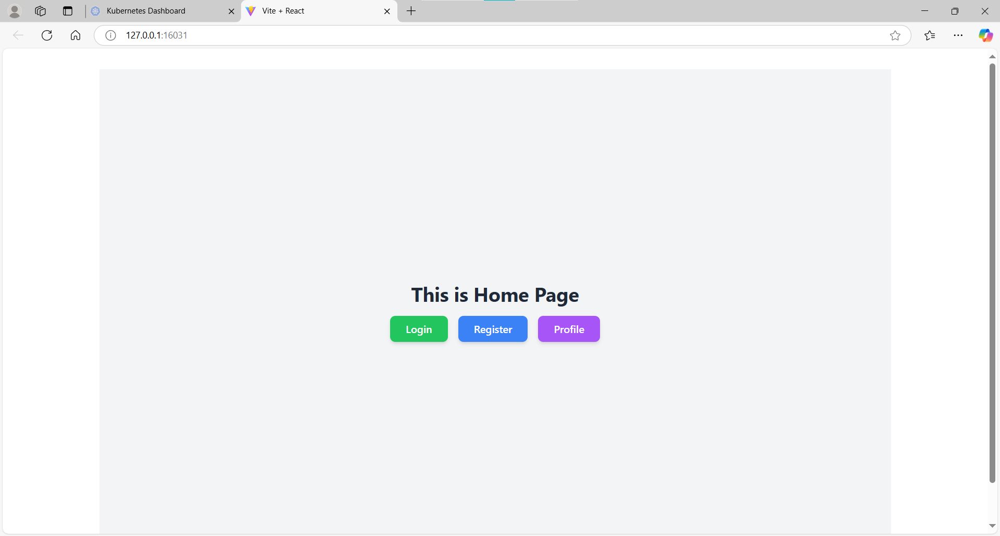
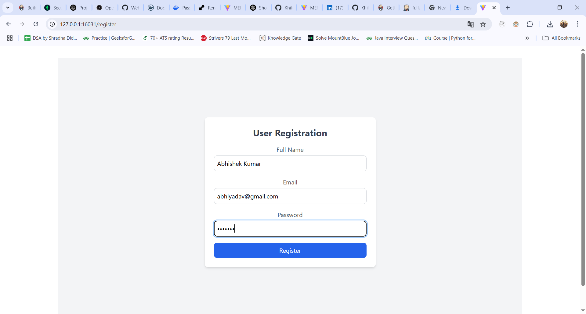
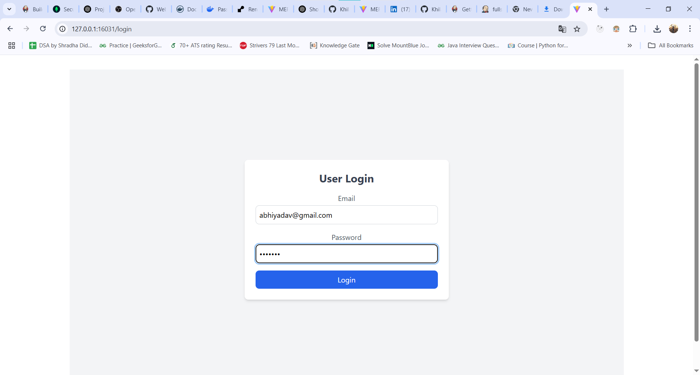
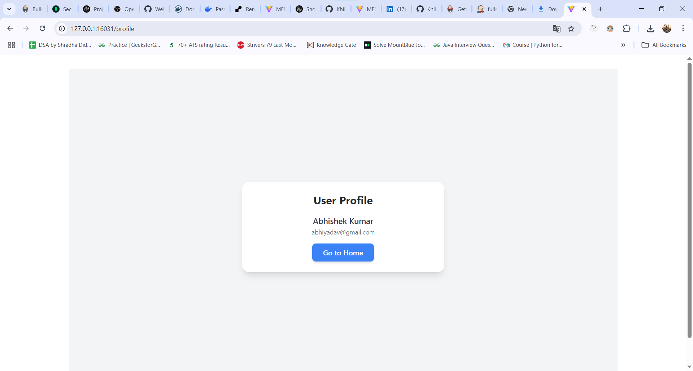
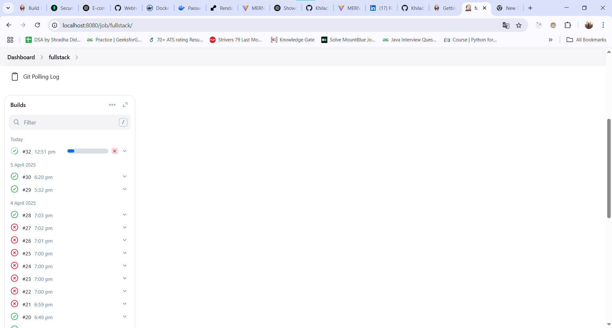
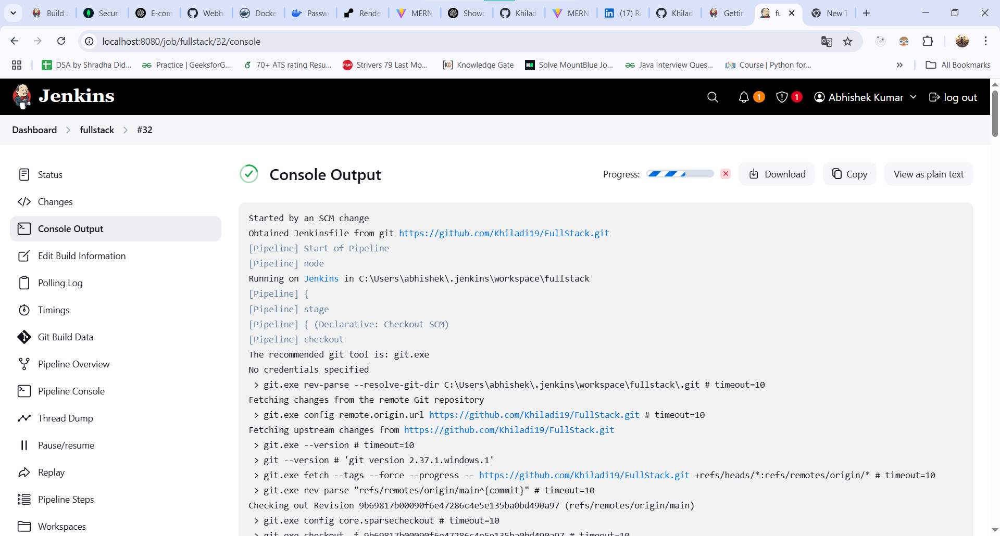
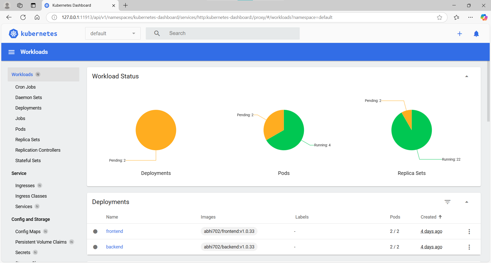
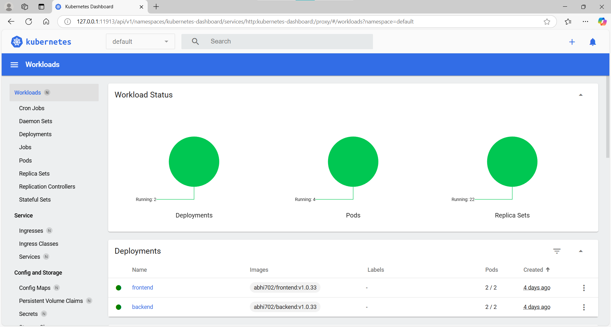

# FullStack Docker + Kubernates + Jenkins

This is a full-stack simple application where users can register, login, profile  features. The project uses **React.js** for the frontend, **Node.js and Express** for the backend, and **MongoDB** as the database. It also includes **Docker** and **Kubernetes** for deployment or **Jenkins** CI/CD piplines.

---

## 🛠️ Technologies Used

- **Frontend**: React.js (Vite),Tailwind CSS
- **Backend**: Node.js, Express.js
- **Database**: MongoDB
- **Tools**: Docker, Kubernetes, Jenkins, EC2

---

## 📁 Project Structure
FullStack/ ├── frontend/ # React frontend ├── backend/ # Express backend ├── kuber/ # Kubernetes files ├── docker-compose.yml # Docker Compose file


---

## 🚀 How to Run the Project

### ✅ Prerequisites

- Node.js installed
- Docker installed
- Kubernetes (Minikube or other cluster)

---

### 🔧 Run with Docker

1. Open terminal and go to the project folder:

```bash
cd FullStack

docker-compose up --build

Frontend: http://localhost:3000
Backend: http://localhost:5000

🧪 Run Manually

Backend
cd backend
npm install
npm run dev

Create a .env file in backend/:
PORT=5000
MONGO_URI=mongodb://localhost:27017/jobportal
JWT_SECRET=your_jwt_secret

Frontend
cd frontend
npm install
npm run dev

Create a .env file in frontend/:
VITE_API_URL=http://localhost:5000

☸️ Deploy with Kubernetes
Start your Kubernetes cluster (e.g., Minikube).

Apply the Kubernetes files:
kubectl apply -f kuber/

📌 Features
User Registration 
User Login
JWT Authentication
Profile token

## 🖼️ Screenshots

### 🏠 Homepage


### 🔐 Register Page


### 🔑 Login Page


### 👤 Profile Page


### ⚙️ Jenkins UI


### 🖥️ Jenkins Console Output


### ☸️ Kubernetes Dashboard


### ✅ Successful Deployment



📝 License
This project is open-source and free to use.


🙌 Thank You
Thanks for checking out this project! 😊
